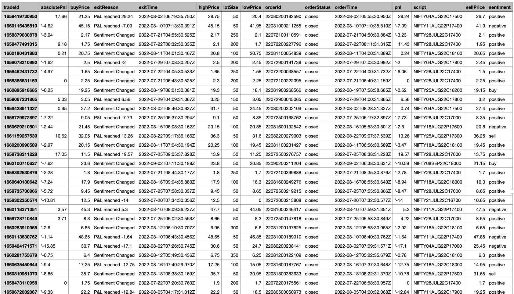

# Algo Trade

NIFTY50 Option Trading based on Global sentiment and well-known technical indicators.

## Note:

1. This is console application still in testing phases. Website and Mobile application launching soon.
2. It can work on one account at a time.
3. You can run in your local or any cloud service with VM.

## Local Setup (console application)

1. Open the folder `app/core`
2. Run the command `yarn install` or `npm install`
3. Create the `.env` file and update the broker details & other configurations. Refer `.env.sample` for more details.
4. Compile the project `tsc`
5. Run the job `yarn run start` or `npm run start`.

## Let's Collaborate! 

Interested in contributing to this project? I'd love to connect! Reach out to me on LinkedIn: <https://www.linkedin.com/in/itaravin/>

## Releases

### V4 (latest) (in development)

Code: testapp/src/upstox/index.ts
Broker: UpStox

| Type       | Indicators                   | Comments                                  | Status   |
| ---------- | ---------------------------- | ----------------------------------------- | -------- |
| Trend      | Moving average               | 5 mins charts - EMA(10), EMA(20), EMA(42) | done     |
| Trend      | Advance Decline Ratio        | NIFTY green/red                           | skip     |
| Trend      | MACD or ADX                  | To know trend & reversal                  | ADX done |
| Trend      | OI Put Call Radio (PCR)      | To know buy sell strength                 | done     |
| Momentum   | RSI                          |                                           | done     |
| Momentum   | Stochastic Oscillator        |                                           | done     |
| Volatility | Bollinger Bands              |                                           | done     |
| Volatility | ATR                          |                                           | done     |
| Volatility | VIX                          |                                           | skip     |
| Volulme    | On-Balance Volume            |                                           | skip     |
| Stop Loss  | Fibonacci Retracement Levels |                                           | skip     |

### V3 (latest)

- Fetch global sentiment from moneycontrol.com
- Fetch nifty50 sentiment from nseindia.com - AD Ratio
- Fetch OI PCR from niftytrader.com
- place order (via upstox)
- exit if profit or loss hit

### V2

- Scrap Investing.com and get global indicies trend
- Scrap Investing.com and get last 1 min trend to get sentiment & direction
- Use technical indicator RSI, MACD, ATR
- If everything goes good, place order (via finvasia)
- Exit the order if profit or loss hit (configurable %)

### V1

- Scrap Investing.com and get global indicies trend
- Scrap Investing.com and get last 5 min trend & 1 min trend to get sentiment & direction
- Use technical indicator ATR, RSI, HL
- If everything goes good, place order (via finvasia)
- Exit the order if profit or loss hit (configurable %)

## Global Sentiments

1. Dow Jones
2. Nikkei 225
3. Hang Seng
4. Shanghai
5. FTSE 100
6. KOSPI 50
7. CAC 40
8. SGX NIFTY

- Brent Oil
- USD/INR

## Technical Indicators

1. Pivot Points
2. Moving Averages
3. RSI
4. MACD

## Configurations

- Max trades per day
- Max profit % per day
- Max profit % per trade
- Max loss % per day
- Max loss % per trade

## How to Access?

- API
- Website

## Supported Brokers

- Finvasia
- Upstox (in progress)

## Important Links

- To get NIFTY50 data nseindia.com/api/equity-stockIndices?index=NIFTY%2050
- To get Global data

## Contact / Issue / Feedback

- <https://github.com/Aravin/Algo-Trade/issues>

## Trade Logs (store in AWS)

