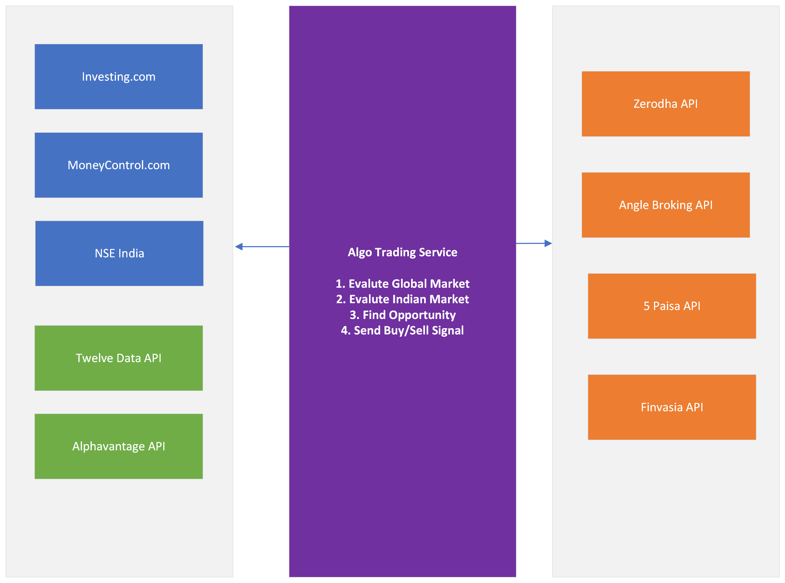
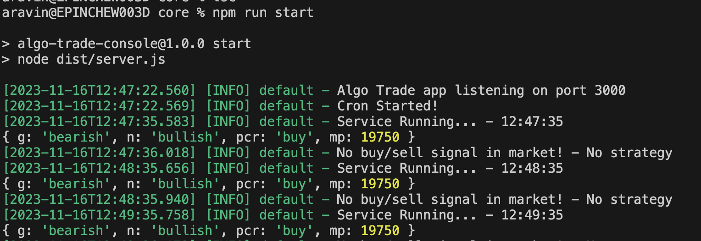
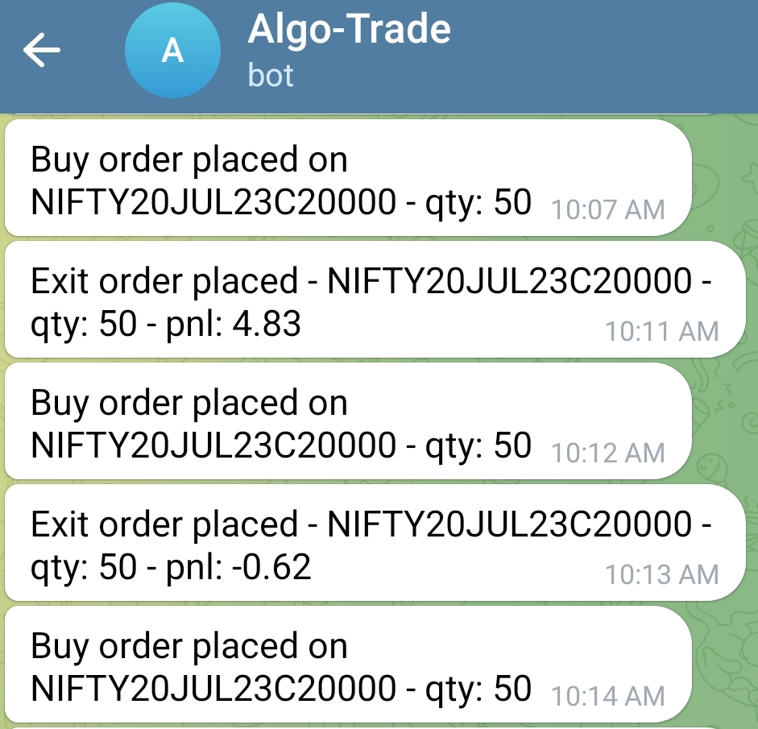
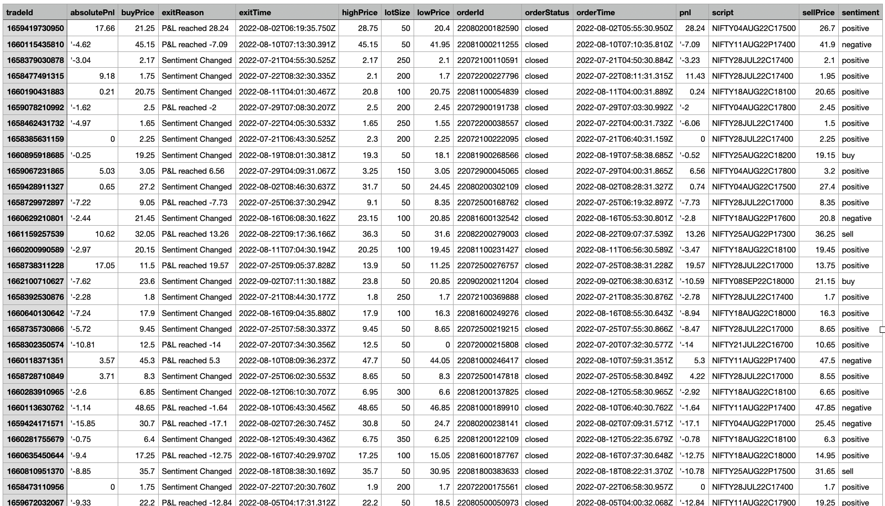

# Algo Trade

Automated NIFTY50 Options Trading bot based on Global sentiment, institutional flows, and real-time technical indicators.



---

## 🚀 Latest: Version 5 (Browser-based Full Automation)

**V5** is a fully browser-based automated trading system for Nifty weekly options. It runs as a React dashboard backed by a Cloudflare Worker proxy and a D1 database for persistence. Order execution and tracking are fully automated via the Upstox API.

### Key Features of V5:
- **5-Layer Scoring Engine**: Combines macro sentiments, technical indicators, and institutional flow into a single unified bullish/bearish score.
- **Web Dashboard**: Modern UI available at `app/client` to control the bot, configure strategies, view signals, and manage positions.
- **D1 Persistence**: Safely persists broker accounts and strategy configuration via a Cloudflare Worker backed by a SQLite D1 database.
- **State Machine Polling**: Robust state management (`IDLE` ➔ `RUNNING` ➔ `ORDERED` ➔ `RUNNING/STOPPED`) polling every 60s.
- **Automated Exit Logic**: Triggered automatically on target profit/loss, indicator/macro reversals, or index breadth flips.

For complete details on the V5 strategy rules, see [docs/v5-strategy.md](docs/v5-strategy.md).

---

## 🛠️ Setup Guide

### V5 Web Client & Worker Setup (Recommended)

To run the latest V5 browser dashboard locally and deploy its backend:

1. Navigate to the client directory:
   ```bash
   cd app/client
   ```
2. Install the required dependencies:
   ```bash
   yarn install
   ```
3. Apply D1 migrations to set up the persistence database locally:
   ```bash
   yarn wrangler d1 migrations apply algo-trade-paper --local
   ```
4. Run the development server:
   ```bash
   yarn dev
   ```
5. *(Optional)* Apply migrations to your remote Cloudflare database and deploy the Worker:
   ```bash
   yarn wrangler d1 migrations apply algo-trade-paper --remote
   yarn deploy
   ```

For detailed client setup and migration steps, refer to [app/client/README.md](app/client/README.md) and [docs/client-persistence.md](docs/client-persistence.md).

---

### V1 - V4 Console Application Setup (Legacy CLI)

If you wish to run the legacy CLI/console versions (V1–V4):

1. Navigate to the core directory:
   ```bash
   cd app/core
   ```
2. Install dependencies:
   ```bash
   yarn install # or npm install
   ```
3. Create a `.env` file and configure your broker credentials. Use `.env.sample` as a template.
4. Compile the TypeScript code:
   ```bash
   tsc
   ```
5. Start the console job:
   ```bash
   yarn start # or npm run start
   ```

#### Console Logs Preview:




---

## 📐 V5 Architecture & Scoring Engine

```
Browser Tab (React + Vite)
│
├─ useStrategyBot.ts          ← State machine, 60s polling loop
│   ├─ fetchMarket()          ← Candles + Option Chain + V3 signals
│   └─ fetchVrd()             ← 8 VRD Nation data points
│
├─ strategyEngine.ts          ← 5-layer scoring → FinalSignal
│   ├─ scoreBullish()         ← BUY CE score (max ~26 pts)
│   └─ scoreBearish()         ← BUY PE score (mirror)
│
├─ Cloudflare Worker          ← CORS proxy for all external APIs
│   ├─ Upstox API             ← Candles, option chain, place/exit orders
│   ├─ MoneyControl API       ← Global indices technical ratings
│   ├─ NiftyTrader API        ← Nifty50 A/D data
│   └─ VRD Nation (scrape)    ← 8 pages of institutional data
│
└─ UI (strategies page)
    ├─ MarketSetupPanel        ← VIX, FII %, Nifty PE, MMI
    ├─ InstitutionalPanel      ← MMI gauge, FII scores
    ├─ BreadthPanel            ← A/D ratio, PCR zone, Straddle IV
    ├─ IndicatorsPanel         ← 6 V4 indicator cards
    ├─ ScorePanel              ← Bull/bear score bars + final signal
    ├─ BotControls             ← Start/Stop, position card, countdown
    └─ StrategyConfig          ← Config form with localStorage
```

### The 5 Scoring Layers
| Layer | Source | Signal & Description |
|---|---|---|
| **L0: Hard Stops** | VRD Nation | Blocks trading completely if VIX is out of bounds (<10 or >25) or Nifty PE > 28. |
| **L1: V3 Macro** | MoneyControl + NiftyTrader | Evaluates global index sentiment (Dow, Nikkei, Hang Seng, FTSE, etc.), Advance/Decline ratios, and Put-Call Ratio (PCR). |
| **L2: V4 Technicals** | Upstox 1-min candles | Real-time indicators: EMA crossover (10/42), ADX, RSI, Stochastic, Bollinger Bands, and ATR. |
| **L3: Institutional** | VRD Nation Scraper | Scrapes institutional flow (MMI, FII Long/Short ratio, Net Positioning, Straddle IV). |
| **L4: Confluence Gate** | Unified Evaluator | Enforces minimum score gap (bull vs bear) and overall score threshold to generate entry signals. |

---

## ⚙️ Strategy Configurations (Editable in UI)

These parameters can be customized dynamically from the dashboard UI:
- **Confidence Thresholds**: Customize minimum scores for both `moderate` and `strong` signals.
- **Profit & Loss Limits**: Set trailing or absolute targets for automatic position exits.
- **Max Trades Per Day**: Protect your account by limiting over-trading.
- **Last Entry Time**: Restrict bot entry signals past a set time (e.g., 14:30 IST).
- **Strike Offset (OTM Skip)**: Configurable offset to purchase out-of-the-money options (default: 3 strikes OTM).

---

## 📜 Release History

* **V5 (Latest)**: React Dashboard with Cloudflare Worker proxy, D1 schema storage, and multi-layer scoring engine.
* **V4 (In Dev / Console)**: Integrates technical indicators directly from Upstox 1-min candles (EMA crossover, ADX, RSI, Stochastic, Bollinger Bands, ATR).
* **V3**: Consolidated macro sentiment fetches from MoneyControl and NSE India, placing orders via Upstox.
* **V2**: Scraped Investing.com for global trends and 1-min indicators, executed trades via Finvasia.
* **V1**: Basic Investing.com scraper with 5-min/1-min trend checks and ATR/RSI, trading via Finvasia.

---

## 🤝 Collaboration & Contact

We welcome contributions! If you would like to collaborate:
- Connect with me on LinkedIn: [itaravin](https://www.linkedin.com/in/itaravin/)
- Submit issues or feature requests: [GitHub Issues](https://github.com/Aravin/Algo-Trade/issues)

#### Trade Logs (stored in AWS for console apps):



